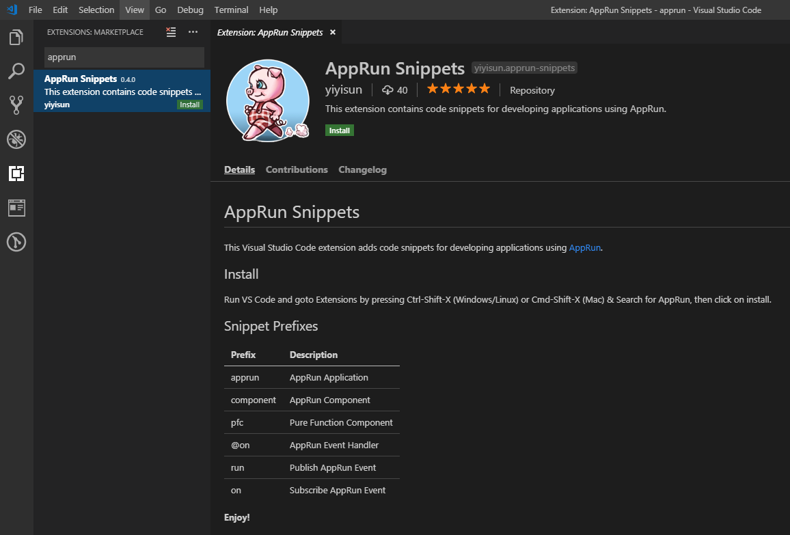

# AppRun [![Build][travis-image]][travis-url] [![NPM version][npm-image]][npm-url] [![Downloads][downloads-image]][downloads-url] [![License][license-image]][license-url] [![twitter][twitter-badge]][twitter] [![Discord Chat][discord-image]][discord-invite]

AppRun is a JavaScript library for building reliable, high-performance web applications using the Elm inspired Architecture, events, and components.

> AppRun is an MIT-licensed open source project. Please consider [supporting the project on Patreon](https://www.patreon.com/apprun). 👍❤️🙏

## AppRun Benefits

* Write less code
* No proprietary syntax to learn
* Compiler/transpiler is optional
* State management and routing included
* Run side-by-side with jQuery, chartjs, D3, lit-html ...

Applications built with AppRun have ** fewer lines of code**, **smaller js files**, and **better performance**. See a comparison from [A Real-World Comparison of Front-End Frameworks with Benchmarks (2019 update)](https://medium.freecodecamp.org/a-realworld-comparison-of-front-end-frameworks-with-benchmarks-2019-update-4be0d3c78075). You can also see the [performance results](https://rawgit.com/krausest/js-framework-benchmark/master/webdriver-ts-results/table.html) compared to other frameworks and libraries in the [js-framework-benchmark](https://github.com/krausest/js-framework-benchmark) project.

## AppRun Book from Apress

[](https://www.amazon.com/Practical-Application-Development-AppRun-High-Performance/dp/1484240685/)

* [Order from Amazon](https://www.amazon.com/Practical-Application-Development-AppRun-High-Performance/dp/1484240685/)


## Architecture Concept

Application logic is broken down into three separate parts in the AppRun architecture.

* State (a.k.a. Model) — the state of your application
* View — a function to display the state
* Update — a collection of event handlers to update the state

AppRun ties the three parts together and drives the applications using events.

## Quick Start

AppRun is distributed on npm.
```sh
npm install apprun
```

You can also load AppRun directly from the unpkg.com CDN:

```javascript
<script src="https://unpkg.com/apprun/dist/apprun-html.js"></script>
```
Or use it as ES module from unpkg.com:
```javascript
<script type="module">
  import { app, Component } from 'https://unpkg.com/apprun@next/esm/apprun-html?module';
</script>
```

## Examples

### Use AppRun in Browsers (HTML)

Below is a counter application using AppRun ([Online Demo](https://apprun.js.org/#play/6)).
```html
<html>
<head>
  <meta charset="utf-8">
  <title>Counter</title>
</head>
<body>
  <script src="https://unpkg.com/apprun/dist/apprun-html.js"></script>
  <script>
    const state = 0;
    const view = state => {
      return `<div>
        <h1>${state}</h1>
        <button onclick='app.run("-1")'>-1</button>
        <button onclick='app.run("+1")'>+1</button>
      </div>`;
    };
    const update = {
      '+1': state => state + 1,
      '-1': state => state - 1
    };
    app.start(document.body, state, view, update);
  </script>
</body>
</html>
```

### Web Component (lit-HTML)

Below is a counter application using AppRun ([Online Demo](https://glitch.com/~apprun-lit-html-wc)).

```html
<html>
<head>
  <meta charset="utf-8">
  <title>Counter Web Component</title>
</head>
<body>
  <wc-lit-html></wc-lit-html>
  <script type="module">
    import { app, Component, html } from 'https://unpkg.com/apprun@next/esm/apprun-html?module';
      class Counter extends Component {
        state = 0;
        view = (state) => html`<div>
        <h1>${state}</h1>
          <button @click=${()=>this.run("add", -1)}>-1</button>
          <button @click=${()=>this.run("add", +1)}>+1</button>
        </div>`;
        update =[
          ['add', (state, n) => state + n]
        ]
      }
      app.webComponent('wc-lit-html', Counter);
    </script>
</body>
</html>
```

## AppRun Playground

Try the [AppRun Playground](https://apprun.js.org/#play) to see more examples.

### Use JSX, Directive, TypeScript and Webpack

You can use AppRun with TypeScript and Webpack. Below is a counter application using AppRun JSX and Directive that can be compiled and bundled using TypeScript and Webpack ([Online Demo](https://apprun.js.org/#play/7)).


```javascript
import app from 'apprun';
const state = 0;
const view = state => <div>
  <h1>{state}</h1>
  <button $onclick={state => state - 1}>+1</button>
  <button $onclick={state => state + 1}>+1</button>
</div>;
app.start(document.body, state, view);
```

Use the AppRun CLI to initialize a TypeScript and webpack configured project:
```sh
npx apprun --init
npm start
```

You can also initialize a SPA project.

```sh
npx apprun --init --spa
```

To initialize a project that targets ES5, use the AppRun CLI with the --es5 flag:

```sh
npx apprun --init --spa --es5
```

Optionally, if not using the CLI you can directly scaffold AppRun project from the AppRun starter templates.
```sh
npx degit apprunjs/apprun-rollup my-app
npx degit apprunjs/apprun-rollup-lit-html my-app
npx degit apprunjs/apprun-webpack my-app
npx degit apprunjs/apprun-parcel my-app
npx degit apprunjs/apprun-web-components my-app
npx degit apprunjs/apprun-bootstrap my-app
npx degit apprunjs/apprun-coreui my-app
npx degit apprunjs/apprun-pwa my-app
npx degit apprunjs/apprun-pwa-workbox my-app
npx degit yysun/apprun-d3 my-app
npx degit yysun/apprun-electron my-app
npx degit yysun/apprun-electron-forge my-app
npx degit yysun/apprun-websockets my-app
```

## Developer Tools

### CLI in Console

AppRun CLI also runs in the console.


To use the AppRun dev-tools CLI, include the dev-tools script.

```JavaScript
<script src="https://unpkg.com/apprun@latest/dist/apprun-dev-tools.js"></script>
```

### Dev-Tools Extensions

AppRun supports the Redux DevTools Extension. To use the dev-tools, install the [Redux DevTools Extension](https://github.com/zalmoxisus/redux-devtools-extension). You can monitor the events and states in the devtools.


### VS Code Extension

AppRun has a code snippet extension for VS Code that you can install from the extension marketplace. It inserts the AppRun code template for application, component and event handling.




## Contribute

You can launch the webpack dev-server and the demo app from the _demo_ folder with the following npm commands:
```sh
npm install
npm start
```

You can run the unit tests from the _tests_ folder.
```sh
npm test
```
Unit tests can serve as functional specifications.

Finally, to build optimized js files to the dist folder, just run:
```sh
npm run build
```

Have fun and send pull requests.

## Contributors
[](https://github.com/yysun/apprun/graphs/contributors)

## License

MIT

Copyright (c) 2015-2020 Yiyi Sun


[travis-image]: https://travis-ci.org/yysun/apprun.svg?branch=master
[travis-url]: https://travis-ci.org/yysun/apprun
[npm-image]: https://img.shields.io/npm/v/apprun.svg
[npm-url]: https://npmjs.org/package/apprun
[license-image]: https://img.shields.io/:license-mit-blue.svg
[license-url]: LICENSE.md
[downloads-image]: http://img.shields.io/npm/dm/apprun.svg
[downloads-url]: https://npmjs.org/package/apprun

[twitter]: https://twitter.com/intent/tweet?text=Check%20out%20AppRun%20by%20%40yysun%20https%3A%2F%2Fgithub.com%2Fyysun%2Fapprun%20%F0%9F%91%8D%20%40apprunjs
[twitter-badge]: https://img.shields.io/twitter/url/https/github.com/yysun/apprun.svg?style=social

[discord-image]: https://img.shields.io/discord/476903999023480842.svg
[discord-invite]: https://discord.gg/M5EDsj